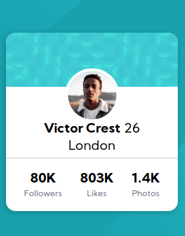

# Frontend Mentor - Profile card component solution

This is a solution to the [Profile card component challenge on Frontend Mentor](https://www.frontendmentor.io/challenges/profile-card-component-cfArpWshJ). Frontend Mentor challenges help you improve your coding skills by building realistic projects. 

## Table of contents

- [Overview](#overview)
  - [The challenge](#the-challenge)
  - [Screenshot](#screenshot)
  - [Links](#links)
- [My process](#my-process)
  - [Built with](#built-with)
  - [What I learned](#what-i-learned)
  - [Continued development](#continued-development)
- [Author](#author)

## Overview

### The challenge

- Build out a responsive profile card.

### Screenshot

### Links

- Solution URL: [Visit solution](https://your-solution-url.com)
- Live Site URL: [Visit live site](https://your-live-site-url.com)

## My process

### Built with

- Semantic HTML5 markup
- CSS 
- Flexbox

### What I learned

I improved my skills in responsive design using better the units **vh, vw** and **calc()**

### Continued development

I'd like keep practicing the responsive design throw **media queries** and responsive sizes.

## Author

+ Website - [www.angelpineda.com.mx](https://www.angelpineda.com.mx)
+ Frontend Mentor - [@angelp495](https://www.frontendmentor.io/profile/angelp495)
+ Twitter - [@AOcelopilli](https://twitter.com/AOcelopilli)
